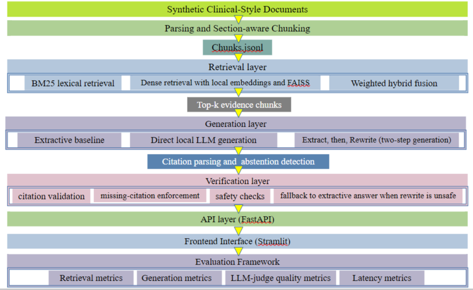

# Offline-First Clinical LLM System

Evaluation-driven Retrieval-Augmented Generation (RAG) framework designed for grounded, privacy-sensitive, and deployment-oriented healthcare AI workflows.

This repository explores reliability, citation grounding, abstention-aware generation, and evaluation strategies for offline clinical-style question answering under real-world operational constraints.

## System Overview

The system combines:

- hybrid retrieval,
- grounded answer generation,
- deterministic verification,
- citation preservation,
- abstention-aware answering
- and evaluation-first development.

Designed for:

- offline inference,
- privacy-sensitive environments,
- reproducible experimentation,
- and clinically grounded AI workflows.

## Ecosystem Context

This repository is part of a broader Clinical AI Systems Ecosystem exploring:
- evidence-grounded healthcare AI,
- multimodal patient modelling,
- evaluation-aware machine learning,
- reproducible experimentation,
- and deployment-oriented clinical AI workflows.

Other repositories in the ecosystem investigate:
- multimodal survival modelling,
- medical imaging representation learning,
- and evidence-aware AI orchestration.
  
### Example Clinical Workflow

A typical evaluation workflow in this repository is:

1. Retrieve relevant evidence chunks from clinical-style documents
2. Validate retrieval quality and citation support
3. Generate grounded answer using evidence-aware generation
4. Apply abstention logic if evidence quality is insufficient
5. Verify citation alignment and response reliability
6. Produce evaluation reports and latency measurements
   
## Key Capabilities
### Retrieval

- Hybrid retrieval (BM25 and dense embeddings)
- Weighted fusion ranking
- Section-aware document chunking
- Retrieval benchmarking and latency analysis

### Grounded Generation

- Citation-grounded response generation
- Deterministic extractive answering
- Two-step extract and rewrite generation
- Verification-aware generation pipeline
- Safe abstention under insufficient evidence

### Evaluation

- Retrieval quality benchmarking
- Citation precision and recall evaluation
- Verification pass-rate analysis
- Latency-aware system evaluation
- Failure-oriented RAG assessment

### Deployment

- Fully offline inference workflow
- Docker-based deployment
- FastAPI backend
- Streamlit interface
- Reproducible local experimentation

## Why This Project

Clinical and healthcare-oriented RAG systems require substantially stronger guarantees than general-purpose LLM applications.

This repository was motivated by several practical issues observed in healthcare-oriented RAG systems:
- retrieved evidence that does not fully support generated claims,
- unstable behaviour under limited-context retrieval,
- latency constraints during local inference,
- and limited transparency in generation pipelines.

The focus is therefore on evidence-grounded generation, verification-aware workflows, and reproducible evaluation rather than conversational fluency alone.
  
  ## Architecture Pipeline



## Benchmark Highlights

The benchmark results are intended primarily for evaluation methodology analysis and comparative workflow assessment under offline/local deployment settings. They should not be interpreted as clinically validated performance claims.

### Retrieval Benchmark

| Method           | Recall@5 ↑ | Recall@10 ↑ | MRR@10 ↑ | nDCG@10 ↑ | p95 Latency ↓ |
|------------------|-----------:|------------:|---------:|----------:|--------------:|
| BM25             | 0.6400     | 0.8517      | 0.5176   | 0.5672    | ~0.3 ms       |
| Dense            | 0.2600     | 0.4583      | 0.1887   | 0.2435    | ~21 ms        |
| Hybrid (RRF)     | 0.6350     | 0.8433      | 0.4521   | 0.5285    | ~18 ms        |
| Hybrid (Weighted)| **0.6908** | **0.8542**  | **0.5691** | **0.6030** | ~19 ms        |

### Key Observations

Hybrid retrieval substantially improves retrieval robustness for structured clinical-style QA compared with dense retrieval alone.

## Generation Benchmark

| Method                | Verif ↑ | Abst Acc ↑ | Cit Prec ↑ | Cit Rec ↑ | Clarity ↑ | Completeness ↑ | Fluency ↑ | Quality ↑ | Latency ↓ |
|----------------------|--------:|-----------:|-----------:|----------:|----------:|----------------:|----------:|----------:|-----------:|
| Extractive           | 1.0000  | 0.9500     | 0.9600     | 0.5150    | 3.90      | 4.19            | 3.92      | 4.00      | 39 ms      |
| Direct LLM           | 0.9200  | 0.0500     | 0.0500     | 0.0400    | 3.04      | 3.25            | 3.03      | 3.11      | ~28,383 ms |
| Extract → Rewrite    | 1.0000  | 0.9500     | 0.9600     | 0.5150    | **3.95**  | **4.23**        | 3.83      | 4.00      | ~29,816 ms |

### Key Observations

Deterministic extractive generation provides stronger reliability under strict citation constraints than direct local LLM generation.

Two-step rewriting improves readability while introducing significant latency overhead.

## Research Contributions

- Evaluation-driven clinical RAG benchmarking
- Grounded generation under citation constraints
- Deterministic verification pipelines
- Abstention-aware clinical QA workflows
- Failure-aware evaluation for offline healthcare LLM systems

  ## Failure Scenarios Explored

This repository also investigates several common failure modes in clinical-style RAG systems:
- retrieval mismatch despite semantically related evidence,
- unsupported citation generation,
- overconfident low-evidence responses,
- latency instability during local inference,
- and degradation under constrained retrieval quality.

These analyses are included because operational robustness is often as important as answer quality in healthcare AI environments.

## Technical Stack
### Core Frameworks

Python • FastAPI • Streamlit • Docker

### Retrieval & NLP

FAISS • BM25 • SentenceTransformers • Transformers

### LLM & Generation

Qwen • Local LLM Inference • RAG Pipeline

### Evaluation

Custom benchmarking pipelines • Retrieval metrics • Verification analysis • Latency evaluation

## Quickstart
### Docker Deployment

'''bash
docker compose -f docker/docker-compose.ymp up --build
'''

## API Endpoints

| Endpoint | Description |
|----------|-------------:|
|POST/query | Generate grounded answer |
|POST/retrieve | Retrieve supporting evidence |
|POST/evaluate| Run evaluation pipeline |
|GET/health | Health check |

## Frontend

The streamlit interface supports:

- query submission,
- evidence inspection,
- citation-grounded responses,
- verification display,
- and latency reporting

## Reproducibility
### Build chunks

```bash
python -m src.cli.build_chunks \ --input-dir data/raw/synthetic_demo \ --output data/processed/chunks.jsonl
```
### Evaluate generation

```bash
python -m src.cli.evaluate_generation \ --eval-file data/evaluation/clinical_rag_eval_full.draft.jsonl \ --retriever hybrid \ --fusion-method weighted \ --generation-mode extractive
```

## Repository Structure

```text
src/
  chunking/
  retrieval/
  generation/
  evaluation/
  cli/

frontend/
  streamlit_app.py

docker/

data/
  raw/
  processed/
  evaluation/

experiments/
  results/

reports/

docs/

scripts/
```

## Detailed Technical Evaluation

Extended benchmarks, ablations, failure analysis, and evaluation details are available in:
[Technical Report](docs/technical_report.md)

## Limitations

- The default corpus is synthetic and designed for evaluation, not clinical deployment.
- The system is not intended for clinical diagnosis or treatment recommendation.
- Current local LLM experiments use lightweight offline models.
- CPU-only local inference introduces high latency for generative workflows.
  
## Ethical Considerations

This repository is intended for:

- AI system research,
- evaluation methodology,
- and engineering demonstration.
  
It is not a medical device and must not be used for clinical decision-making.

All generation workflows are constrained by:
- retrieved evidence,
- citation verification,
- and abstention logic.

  ## Engineering Design Priorities

The repository emphasises:
- modular experimentation,
- deterministic evaluation,
- reproducible local inference,
- transparent retrieval-generation separation,
- and deployment-oriented benchmarking.

The intention is to support controlled experimentation for healthcare AI workflows rather than build a general-purpose chatbot system.

## Current Research Direction

- Retrieval-to-generation error correlation analysis
- Cross-encoder reranking evaluation
- PEFT/LoRA adaptation studies
- Latency optimisation for offline inference
- Extended benchmarking on real-world datasets
- Reliability-aware healthcare LLM evaluation

## Citation

If you use or reference this repository in research or technical work, please cite appropriately or reference the project repository.

## Author

Toktam Khatibi

Senior Machine Learning Research Scientist

Clinical AI • Medical Imaging • Multimodal AI • Evaluation-Driven Healthcare LLM Systems
must be justified by measurable quality gains relative to its latency cost.
